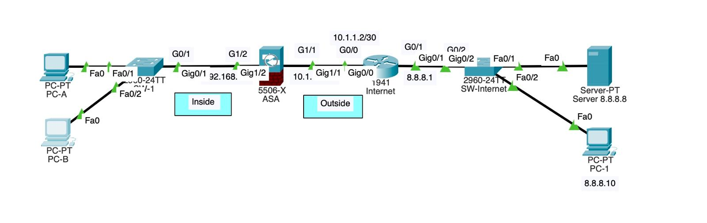

# Configuring Cisco ASA 5506-X Firewall

This exercise demonstrates how to configure a Cisco ASA 5506-X firewall in a basic network topology. It covers interface configuration, security levels, DHCP server setup, routing, and inspection policies.



[⬇️ Download Exercise](./Exercise22.pkt)


## Network Topology

The setup includes:
- Internet Router (Router1) with interfaces to simulate the Internet and connect to the ASA
- ASA 5506-X Firewall with outside and inside interfaces
- PC-A and PC-B connected to the inside network
- Server (8.8.8.8) accessible via the Internet

## Configuration Steps

### 1. Internet Router Configuration

First, configure the Internet router (Router1):

```
Router1# configure terminal
Router1(config)# interface GigabitEthernet0/1
Router1(config-if)# ip address 8.8.8.1 255.255.255.0
Router1(config-if)# no shutdown
Router1(config-if)# interface GigabitEthernet0/0
Router1(config-if)# ip address 10.1.1.2 255.255.255.252
Router1(config-if)# no shutdown
Router1(config-if)# exit
```

### 2. Initial ASA Firewall Configuration

Access the ASA and set basic parameters:

```
> enable
Password: 
# configure terminal
(config)# hostname ASA
ASA(config)# enable password cisco
```

### 3. Checking and Removing Default Interface Configurations

Check the current configuration:

```
ASA# show running-config
```

Note: By default, interface G1/1 has an IP address, interface name, and security level pre-configured. Similarly, G1/2 is configured as a DHCP client.

Remove these default configurations:

```
ASA# configure terminal
ASA(config)# interface GigabitEthernet1/1
ASA(config-if)# no ip address
ASA(config-if)# no nameif
ASA(config-if)# no security-level
ASA(config-if)# interface GigabitEthernet1/2
ASA(config-if)# no nameif
ASA(config-if)# no security-level
ASA(config-if)# no ip address dhcp
```

Verify the configurations have been removed:

```
ASA# show run
```

### 4. Configure ASA Interfaces

Configure the outside interface (G1/1):

```
ASA# configure terminal
ASA(config)# interface GigabitEthernet1/1
ASA(config-if)# ip address 10.1.1.1 255.255.255.252
ASA(config-if)# nameif outside
ASA(config-if)# security-level 0
ASA(config-if)# no shutdown
```

Configure the inside interface (G1/2):

```
ASA(config-if)# interface GigabitEthernet1/2
ASA(config-if)# ip address 192.168.1.1 255.255.255.0
ASA(config-if)# nameif inside
ASA(config-if)# security-level 100
ASA(config-if)# no shutdown
```

Verify interface configurations:

```
ASA# show ip interface brief
```

### 5. Configure DHCP Server on ASA

Create an IP address pool, specify DNS server, and define the default gateway:

```
ASA(config)# dhcpd address 192.168.1.10-192.168.1.20 inside
ASA(config)# dhcpd dns 8.8.8.8
ASA(config)# dhcpd option 3 ip 192.168.1.1
ASA(config)# dhcpd enable inside
```

### 6. Configure Client PCs

On PC-A and PC-B:
- Access the Desktop tab
- Select IP Configuration
- Choose DHCP as the IP assignment method
- Verify they receive IP addresses from the DHCP pool

### 7. Configure Default Route on ASA

```
ASA(config)# route outside 0.0.0.0 0.0.0.0 10.1.1.2
```

### 8. Configure NAT on ASA

Create a network object and configure dynamic NAT:

```
ASA(config)# object network INSIDE-NET
ASA(config-network-object)# subnet 192.168.1.0 255.255.255.0
ASA(config-network-object)# nat (inside,outside) dynamic interface
ASA(config-network-object)# exit
```

### 9. Test Connectivity and Configure Traffic Inspection

Test internal connectivity:

```
PC-A> ping 192.168.1.1
```
This should succeed.

Test external connectivity:

```
PC-B> ping 8.8.8.8
```
This will initially fail because ICMP traffic is blocked by the ASA.

### 10. Configure Inspection Policies

Configure a class map for inspection:

```
ASA(config)# class-map inspection_default
ASA(config-cmap)# match default-inspection-traffic
ASA(config-cmap)# exit
```

Create a policy map and enable ICMP inspection:

```
ASA(config)# policy-map global_policy
ASA(config-pmap)# class inspection_default
ASA(config-pmap-c)# inspect icmp
ASA(config-pmap-c)# exit
ASA(config-pmap)# exit
```

Apply the policy globally:

```
ASA(config)# service-policy global_policy global
```

### 11. Verify ICMP Connectivity

Now test ICMP connectivity again:

```
PC-A> ping 8.8.8.8
```
This should now succeed.

### 12. Enable HTTP Inspection

Try to access the web server:

```
PC-B> web browser 8.8.8.8
```
This will initially fail because HTTP traffic is not inspected.

Configure HTTP inspection:

```
ASA(config)# policy-map global_policy
ASA(config-pmap)# class inspection_default
ASA(config-pmap-c)# inspect http
ASA(config-pmap-c)# exit
ASA(config-pmap)# exit
```

Test HTTP connectivity again:

```
PC-B> web browser 8.8.8.8
```
This should now succeed.

### 13. Enable DNS Inspection

Try to ping by hostname:

```
PC-B> ping www.ccnasecurity.com
```
This will initially fail because DNS traffic is blocked.

Configure DNS inspection:

```
ASA(config)# policy-map global_policy
ASA(config-pmap)# class inspection_default
ASA(config-pmap-c)# inspect dns
ASA(config-pmap-c)# exit
ASA(config-pmap)# exit
```

Test DNS resolution:

```
PC-B> ping www.ccnasecurity.com
```
This should now succeed.

## Summary

This exercise demonstrates how to:
1. Configure ASA interfaces with appropriate security levels
2. Set up a DHCP server for internal clients
3. Configure NAT for internal-to-external communication
4. Set up a default route
5. Configure inspection policies for ICMP, HTTP, and DNS traffic

These configurations allow internal clients to communicate with external servers while maintaining security controls through the ASA firewall.
